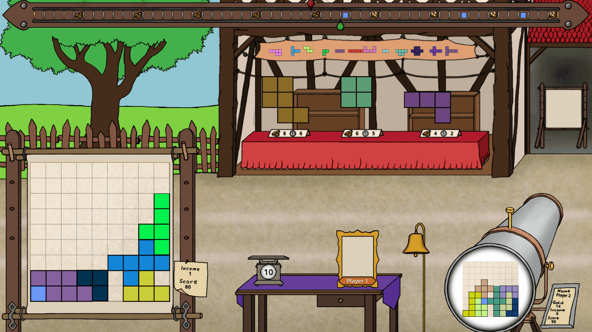
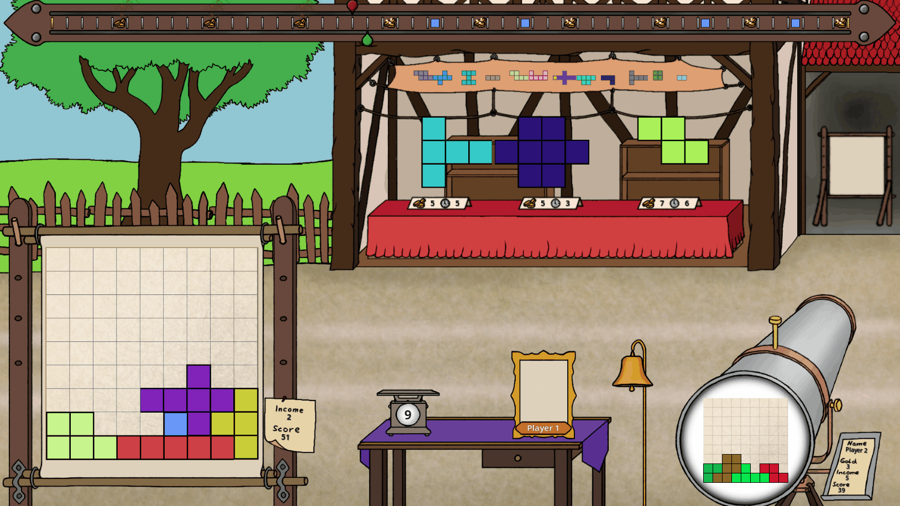
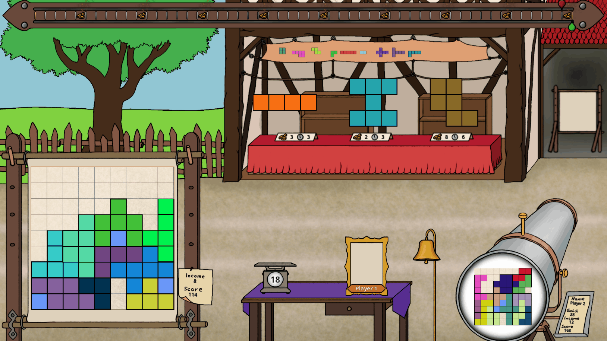

# Patchwork

  <a href="#-introduction">Introduction</a> •
  <a href="#-current-progress">Current Progress</a> •
  <a href="#-architecture">Architecture</a>

## 🎴 Introduction

This project is a C# implementation of the board game **Patchwork**.  
See the [rulebook](https://cdn.1j1ju.com/medias/74/af/f2-patchwork-rulebook.pdf) for the original game rules.

## 📸 Current Progress

This is a work-in-progress project.  
While the game is already playable, some art assets and additional features are still being updated and refined.  
The following GIFs demonstrate the current state of the project.

### Patch Transformation and Placement

### Obtaining Gold and Special Patch

### Game End Scene Transition

## 🧱 Architecture

This project follows a four-layer architecture that separates UI, game logic, domain model, and static data:

| Layer | Directory | Responsibility |
| --- | --- | --- |
| **UI Layer** | `Scenes` | <ul><li>Contains the Godot scene files and the corresponding C# scripts.</li><li>Responsible for rendering the user interface and handling user input.</li><li>Forwards player actions and reflects the current game state through visual updates.</li></ul> |
| **Service Layer** | `Service` | <ul><li>Contains the game logic and controls the game flow.</li><li>Updates the game state in the domain layer upon user input.</li><li><code>RootService</code> acts as a central coordinator, providing access to all services and orchestrating interactions between layers.</li></ul> |
| **Domain Layer** | `Domain` | <ul><li>Defines the domain model of the game.</li><li><code>GameState</code> represents a single game instance and acts as the central state holder.</li><li>Aggregates other domain objects such as <code>Timeline</code> and <code>PatchShop</code>, which represent the fundamental elements of the game.</li></ul> |
| **Data Layer** | `Data` | <ul><li>Stores static data such as patch definitions.</li></ul> |

